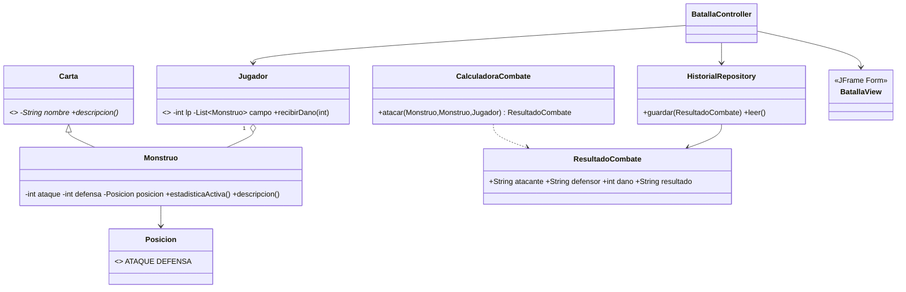

```mermaid
classDiagram
class Carta { <<abstract>> -String nombre +descripcion()* }
class Monstruo { -int ataque -int defensa -Posicion posicion +estadisticaActiva() +descripcion() }
class Jugador { <<entity>> -int lp -List~Monstruo~ campo +recibirDano(int) }
class CalculadoraCombate { +atacar(Monstruo,Monstruo,Jugador) ResultadoCombate }
class ResultadoCombate { +String atacante +String defensor +int dano +String resultado }
class HistorialRepository { +guardar(ResultadoCombate) +leer() }
class BatallaView { <<JFrame Form>> }
class BatallaController
class Posicion { <<enumeration>> ATAQUE DEFENSA }
Carta <|-- Monstruo
Monstruo --> Posicion
Jugador "1" o-- "*" Monstruo
CalculadoraCombate ..> ResultadoCombate
BatallaController --> BatallaView
BatallaController --> Jugador
BatallaController --> HistorialRepository
HistorialRepository --> ResultadoCombate
```
